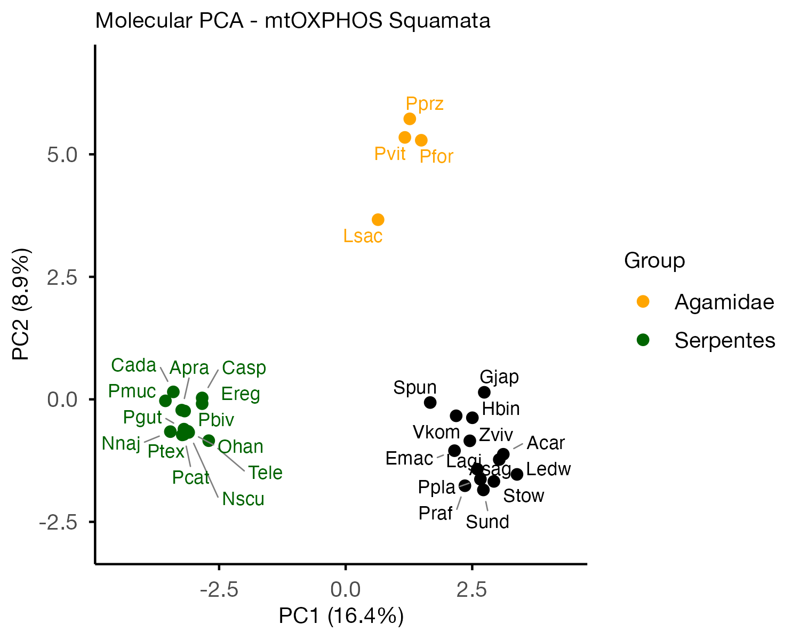
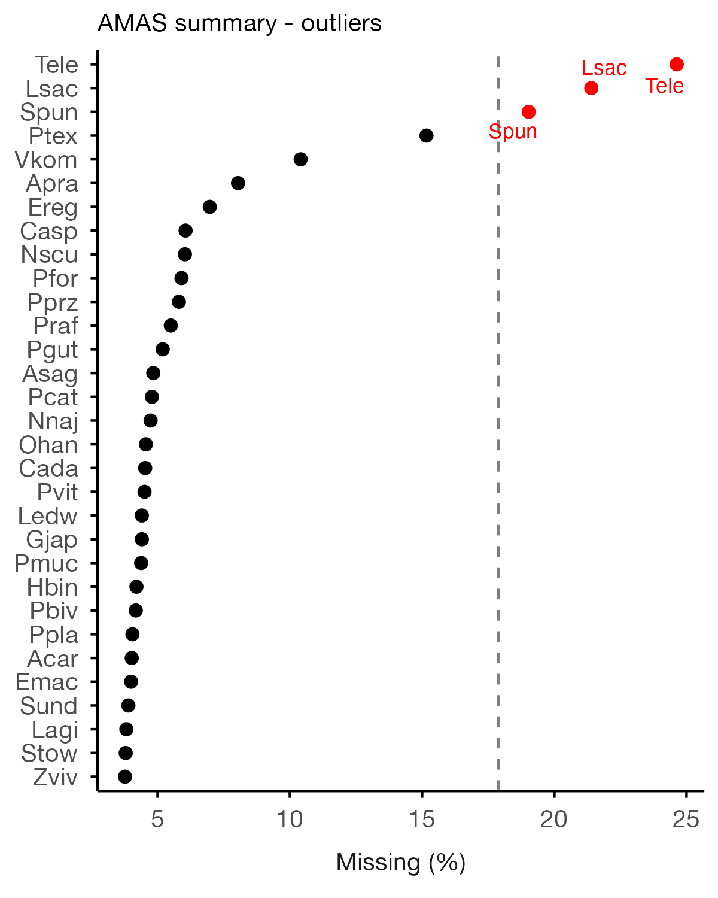
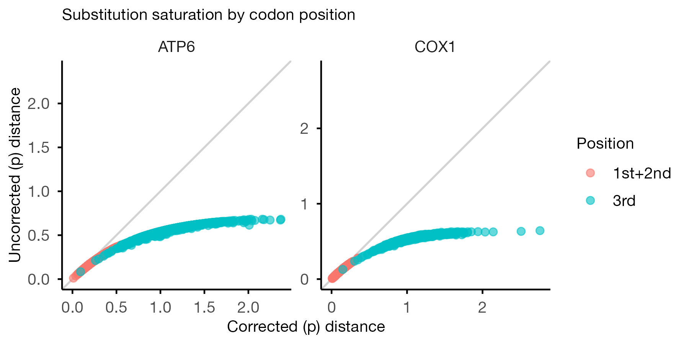

# fastPlot-bio

<table width="100%">
<tr>
<td width="50%">

### molPCA.R

Molecular PCA from an aligned FASTA file, with optional group coloring from a CSV.

</td>
<td width="50%">

</td>
</tr>

<tr>
<td width="50%">

### taxonOutliers.R

Flags taxa that are outliers on any statistic column from a summary table (e.g. `AMAS.py summary`), labeling them directly on the plot. Optionally, with a `groups.csv`, it compares groups via horizontal boxplots instead. This script will be updated to allow different inputs.

</td>
<td width="50%">

</td>
</tr>

<tr>
<td width="50%">

### codonSaturation.R

A substitution-saturation plot: pairwise corrected vs. observed genetic distances, computed separately for each codon position from an aligned coding-sequence FASTA file. A quick, assumption-free way to see whether the third base is saturated.

</td>
<td width="50%">

</td>
</tr>
</table>
